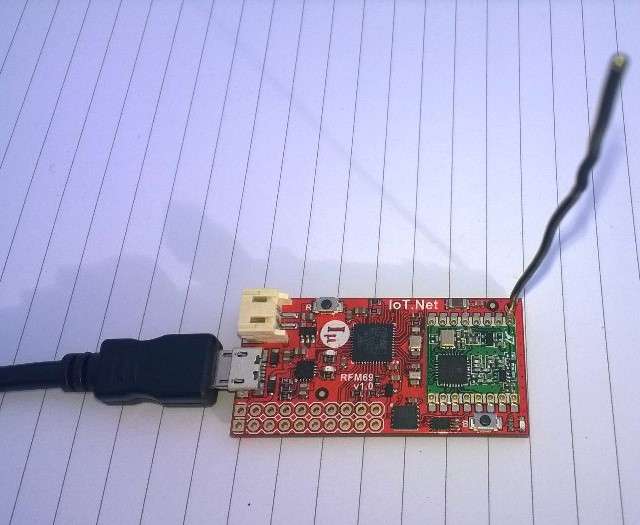

# FieldGateway.LoRa.IoTNetClient
ingenuity micro NetMF client for my Windows 10 IoT Core LoRa field gateways

The [RFM9XLoRa-NetMF](https://github.com/KiwiBryn/RFM9XLoRa-NetMF) library is my own work.
The AbstractI2CDevice library was developed by Zakie Mashiah with modifications by Thomas D. Kryger.
Uncertain of the origin of the MCP9808 library

The development of this client is covered (https://blog.devmobile.co.nz/2018/09/20/iot-net-lora-radio-915-mhz-payload-addressing-client/)

This Demo client uses [IoT.Net LoRa device](https://http://www.ingenuitymicro.com/) and its onboard temperature sensor

